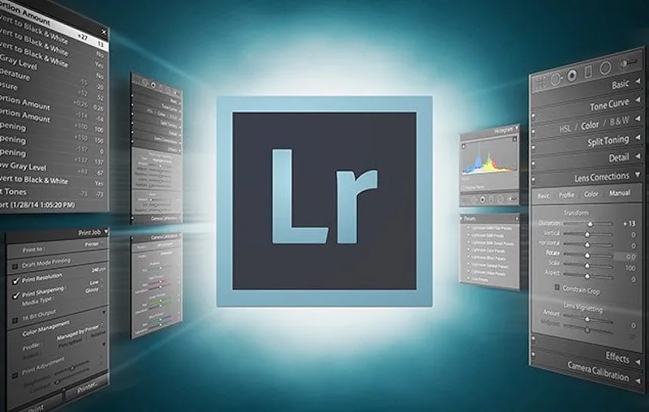

# 🚀 **lightroom cc crack** | **lightroom 2023 crack**

Unleash the power of innovation with **lightroom cc crack**, a cutting-edge solution designed to elevate your software experience. With unmatched **reliability** and a focus on superior **quality**, it delivers seamless performance and advanced features that cater to your most demanding needs. Whether you're building for scalability or precision, **lightroom cc crack** empowers you to achieve excellence effortlessly.

## 🛠️ Support for **crack for lightroom**

Need help with **crack for lightroom**? We've got you covered! Below is all the support information you need to ensure a seamless experience.

### Technical Support Availability
Our dedicated team provides reliable technical support for all your **crack for lightroom** needs. Whether it's troubleshooting or feature inquiries, we're here to assist you:
- **24/7 Support**: Available round the clock.
- **Response Time**: Typically within 1-2 business hours.

### Documentation and Resources
Access comprehensive guides and tutorials to make the most of **lightroom crack pc**:
- **Official Documentation**: In-depth explanations and best practices.
- **Quick Start Guides**: Get up and running in no time.
- **API References**: Detailed specs for developers.

### Community Forums
Join our vibrant community to connect with fellow users and experts:
- **Discussion Boards**: Share ideas, tips, and solutions.
- **FAQ Section**: Find answers to common questions.
- **Feature Requests**: Suggest enhancements for future updates.

### Update and Maintenance
We prioritize reliability and performance with regular updates:
- **Frequent Updates**: Ensuring compatibility and new features.
- **Maintenance Schedule**: Planned downtime communicated in advance.

## 🌟 Benefits of **lightroom cc crack**

- 💼 **Professional Software Capabilities**  
  With **lightroom cc crack**, you gain access to advanced **lightroom crack pc** features designed for professionals. These capabilities ensure high performance, scalability, and reliability, empowering users to achieve their goals efficiently.

- 🎨 **User-Friendly Interface**  
  Our intuitive design makes **lightroom cc crack** easy to navigate, even for beginners. The clean layout and straightforward controls allow users to focus on what matters most without getting overwhelmed by complexity.

- 🔄 **Regular Updates and Improvements**  
  Stay ahead with continuous updates that bring new functionalities and optimizations. We prioritize keeping **lightroom cc crack** up-to-date so you always have access to the latest tools and improvements.

- 👨‍💻 **Technical Support Availability**  
  Need help? Our dedicated support team is here for you! Whether it’s troubleshooting or answering questions about **lightroom crack pc**, we’re committed to ensuring a smooth experience for all users.

Ready to experience the power of **lightroom cc crack**?  

## Getting Started with **lightroom with crack**

Welcome to the **lightroom with crack**! Below is a step-by-step guide to help you get started with ease. Follow these instructions to download, install, and configure the software for your first use.

1. 📥 **Download and Installation**
   - Visit the official website or repository of **lightroom with crack**.
   - Download the latest stable version suitable for your operating system.
   - Run the installer and follow the on-screen instructions to complete the installation process.

2. 🔧 **Initial Setup**
   - Once installed, launch **lightroom with crack** from your applications menu.
   - You will be prompted to create a new project or open an existing one.
   - Choose "Create New Project" to begin setting up your environment.

3. ⚙️ **Basic Configuration**
   - Navigate to the settings menu by clicking on **lightroom crack windows** in the toolbar.
   - Configure basic options such as language preferences, theme selection, and default directories.
   - Save your settings to ensure a personalized experience tailored to your needs.

4. 🚀 **First Use Guide**
   - Start by exploring the main interface of **lightroom with crack**.
   - Use the built-in tutorial feature to learn more about key functionalities.
   - Experiment with sample projects to familiarize yourself with the tools and features available.

---

Ready to dive in? Follow the steps above to get started with **lightroom with crack** today!

